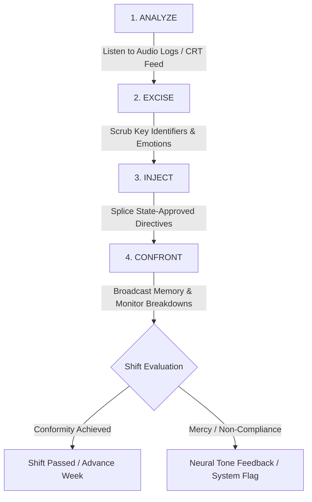

# THE ECHO CHAMBER

**A First-Person Psychological Thriller & Memory Alteration Simulation**

[](#)
[](#)
[](#)
[](#)

> *"Compliance is survival. Memory is currency."*

---

## 📋 Table of Contents
- [Overview](#-overview)
- [The Core Premise](#-the-core-premise)
- [Core Gameplay Pillars](#-core-gameplay-pillars)
  - [1. Isolation](#1-isolation)
  - [2. Identity & The Memory Loom](#2-identity--the-memory-loom)
  - [3. Player as Villain](#3-player-as-villain)
  - [4. The Merging (Narrative Twist)](#4-the-merging-narrative-twist)
- [The Shift Workflow (Gameplay Loop)](#-the-shift-workflow-gameplay-loop)
- [Terminal Interface Mockup](#-terminal-interface-mockup)
- [Audio & Visual Design](#-audio--visual-design)
- [Project Roadmap](#-project-roadmap)

---

## 👁️ Overview

**THE ECHO CHAMBER** is a claustrophobic first-person psychological thriller and narrative simulation set in the depths of a subterranean re-education complex. 

Sitting in a dimly lit concrete bunker before a towering wall of flickering CRT monitors, you assume the role of **Dr. Kaito Suzuki**, the sole night-shift operator tasked with systematically erasing and rewriting the minds of political dissidents.

---

## 🏛️ The Core Premise

```text
+-----------------------------------------------------------------------+
| FACILITY:   The Chrysalis Institute (Subterranean Re-education)       |
| OPERATOR:   Dr. Kaito Suzuki [Night-Shift Monitor]                 |
| TARGET:     Subject 41 [Classified Political Dissident]               |
| DIRECTIVE:  Systematic Sensory Memory Alteration & Identity Erasure   |
+-----------------------------------------------------------------------+
```

You sit alone in a concrete bunker, staring at a massive wall of CRT monitors. Your only job is to interact with **Subject 41** via a microphone, reviewing their memories, and using a control panel to systematically erase or alter parts of their identity until they conform.

---

## ⚡ Core Gameplay Pillars

| Pillar | Focus | Key Gameplay Impact |
| :--- | :--- | :--- |
| **Environmental Isolation** | Physical & Social Confinement | Zero face-to-face NPC interaction. Entire world reduced to a desk, CRT screens, fluorescent hum, and intercom static. |
| **Identity Manipulation** | Audio/Visual Splicing | Use the digital **Memory Loom** to slice voice audio/video and construct plausible lies from pieces of real history. |
| **Forced Complicity** | Player as Villain | No twist hero ending. You actively dismantle a human being's soul. Mercy triggers automated disciplinary feedback. |
| **Cognitive Recursion** | Reality Breakdown | Desktop items match scrubbed memories; logbook entries appear in your handwriting without your memory of writing them. |

### 1. Isolation
The game leans heavily into environmental and psychological isolation.
* **The Setting:** There are no other NPCs to interact with face-to-face. Your entire world is a dimly lit desk, the hum of fluorescent lights, the drip of a pipe, and the distorted voice of Subject 41 coming through a crackling intercom.
* **The Audio:** The sound design is hyper-focused on your own breathing, the mechanical clicks of your console, and the eerie, dead silence of the bunker. The outside world does not exist.

### 2. Identity
Identity is the ultimate currency and weapon in this game.
* As the monitor, you slice away Subject 41’s childhood memories, their love stories, and their core beliefs, replacing them with sterile, state-approved propaganda.
* You use a digital **"Memory Loom"** to splice audio and video files. To make a lie stick, you have to craft it using pieces of their real voice and history.

### 3. Player as Villain
There is no twist ending where you discover you were the good guy all along. **You are the monster.**
* The game forces you to actively dismantle a human being's soul to progress. Subject 41 will beg, cry, bargain, and scream. To pass each "shift," you must successfully gaslight them into believing their real family never existed.
* **Compliance is Survival:** If you try to be merciful or input "correct" memories, the facility's automated supervisor system flags you, delivering painful auditory feedback or threatening to make you the next subject.

### 4. The Merging (Narrative Twist)
<details>
<summary><b>⚠️ SPOILER WARNING: Click to reveal narrative twist & climax mechanics</b></summary>

<br>

As the weeks progress, the isolation begins to warp your own reality, creating a deeply unsettling realization about identity:

1. **Desktop Anomalies:** The memories you are scrubbing from Subject 41 start matching the few personal items on your own desk (a photograph of a spouse you can't quite remember, a childhood toy).
2. **Missing Time:** You begin to notice gaps in your own logbooks. The handwriting from previous shifts is yours, but you have no memory of writing the entries.
3. **The Climax:** You realize that The Chrysalis Institute is entirely automated. There is no supervisor. You are not a free employee. You are a previous iteration of Subject 41, brainwashed into torturing your own cloned or captured self to perpetuate a cycle of total erasure.

</details>

---

## 🔄 The Shift Workflow (Gameplay Loop)

Every shift follows a strict four-stage re-education protocol:



### Protocol Execution Steps:
* **ANALYZE:** Listen to an audio log of Subject 41 describing their mother's funeral.
* **EXCISE:** Use the console to scrub out keywords like `"mother"`, `"love"`, and `"grief"`.
* **INJECT:** Type in or select state-mandated replacements (*"The State is your mother"*, *"Isolation is peace"*).
* **CONFRONT:** Broadcast the altered memory back to the subject and listen to their psychological resistance break down in real-time.

---

## 🖥️ Terminal Interface Mockup

```text
================================================================================
 [ CHRYSALIS OPERATING SYSTEM v4.12 ] - TERMINAL 07
 AUTOMATED SURVEILLANCE: ACTIVE | NEURAL FEEDBACK CIRCUIT: ONLINE
================================================================================

  [ CRT FEED 01 ]                                [ MEMORY LOOM WAVEFORM ]
  +-----------------------+                      +-------------------------------+
  | SUBJECT 41: MONITORING|                      | /\/\__/\___/\/\/\____/\/\/\_/ |
  | HEART RATE: 118 BPM   |                      | TIMESTAMP: 00:04:12:08        |
  | STABILITY: CRITICAL   |                      +-------------------------------+
  +-----------------------+                      [ EXCISE KEYWORDS ]
                                                  > [MOTHER]  - SCRUBBED
  [ INTERCOM AUDIO ]                              > [GRIEF]   - SCRUBBED
  Subject 41: "Please... I remember her..."      > [LOVE]    - SCRUBBED
  System: INPUT MANDATED REPLACEMENT...          
                                                 [ INJECT PARAMETERS ]
  > Option 1: "The State is your mother."         > [SELECTED]
  > Option 2: "You were born in Sector 07."      
  > Option 3: [ERROR: MERCY PROHIBITED]          [ BROADCASTING ALTERED MEMORY ]
================================================================================
```

---

## 🔊 Audio & Visual Design

* **Aesthetic:** Brutalist retro-futurism (1980s cold-war technology meets dystopian bureaucracy). Phosphor phosphor-decay CRT monitors, tactile mechanical switches, reel-to-reel tape decks.
* **Soundscape:** Highly detailed spatial audio featuring heavy breathing, transformer hum, concrete reverb, tape hiss, and realistic voice distortion for Subject 41's intercom communications.

---

## 📑 Project Status & Specs

* **Genre:** Psychological Thriller / First-Person Narrative Simulation
* **Engine:** Unity / Unreal Engine 5 (Focus on diegetic physical interaction)
* **Audio Pipeline:** Custom DSP Filters & FMOD for real-time voice degradation
* **Status:** Narrative & Technical Design Concept Document

---

## 📜 License

This repository contains creative design materials for the fictional game concept **THE ECHO CHAMBER**. All rights reserved.

