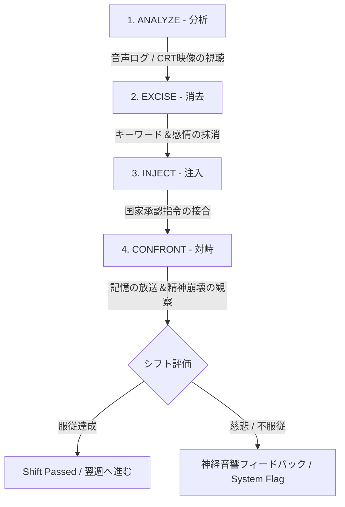

# THE ECHO CHAMBER
**一人称視点 心理サスペンス ＆ 記憶改ざんシミュレーション**

[](#)
[](#)
[](#)
[](#)

> *"服従こそが生存。記憶こそが通貨。"*

---

## 👁️ 概要 (Overview)

**『THE ECHO CHAMBER』**は、地下再教育施設の深部を舞台とした、閉塞感あふれる一人称視点の心理サスペンス＆ナラティブ・シミュレーションゲームです。

薄暗いコンクリートのバンカーの中、明滅する巨大なCRTモニターの壁に向かい合い、あなたは**スズキ・カイト博士**となります。彼の唯一の仕事は、夜間監視員として反体制分子の精神をシステム的に消去・改ざんすることです。

---

## 🏛️ 核心となる前提 (The Core Premise)

```text
+-----------------------------------------------------------------------+
| 施設:       クリサリス研究所（地下再教育施設）                          |
| 担当者:     スズキ・カイト博士 [夜間監視員]                            |
| 対象:       被験者41号 [機密・政治的反体制分子]                         |
| 指令:       段階的感覚記憶改ざん ＆ 人格消去                            |
+-----------------------------------------------------------------------+
```

あなたはコンクリートのバンカーに一人佇み、巨大なCRTモニターの壁を見つめています。あなたの唯一の仕事は、マイク越しに**被験者41号**と対話し、彼の記憶を検証し、操作パネルを使って彼が服従するまで人格の一部をシステム的に消去・改ざんすることです。

---

## ⚡ 核心的なゲームプレイの柱 (Core Gameplay Pillars)

| 要素 | 焦点 | ゲームプレイへの影響 |
| :--- | :--- | :--- |
| **環境的孤立** | 物理的・社会的隔離 | 直接対面するNPCは存在しない。世界全体がデスク、CRT画面、蛍光灯のハミング音、インターホンのノイズだけに縮小する。 |
| **人格操作** | 音声・映像の接合（スプライシング） | デジタル「**記憶の織機（Memory Loom）**」を使い、音声/映像ファイルを切り貼りして、実在の歴史の断片から納得感のある嘘を構築する。 |
| **強制された加害性** | 悪役としてのプレイヤー | 自分が正義だったというどんでん返しの結末はない。プレイヤーは人間性の魂を自ら破壊していく。慈悲を見せると自動警告システムが作動する。 |
| **認知の再帰性** | 現実の崩壊 | デスクの私物が消去した記憶と一致し始める。過去のシフトの日誌には記憶にない自分の手書き文字が残されている。 |

### 1. 孤立 (Isolation)
ゲームは環境的・心理的な孤立感を徹底的に追求します。
* **舞台設定:** 対面で会話できるNPCは一切登場しません。あなたの世界のすべては、薄暗いデスク、蛍光灯のうなり音、配管の水滴音、そしてノイズ混じりのインターホンから流れる被験者41号の歪んだ声だけで構成されています。
* **オーディオ:** サウンドデザインは、プレイヤー自身の呼吸音、コンソールの機械的なクリック音、そしてバンカーの不気味な静寂に強く焦焦点当てています。外の世界は存在しません。

### 2. 人格 (Identity)
このゲームにおいて、人格（アイデンティティ）は究極の通貨であり兵器です。
* 監視員として、あなたは被験者41号の幼少期の記憶、愛の記憶、核心的な信念を削ぎ落とし、国家承認済みの無機質なスローガンに置き換えていきます。
* デジタルツール「**記憶の織機（Memory Loom）**」を使って音声や映像ファイルを接合します。嘘を定着させるには、本人の実際の声や歴史の断片を使って巧みに偽造しなければなりません。

### 3. 悪役としてのプレイヤー (Player as Villain)
「実は自分はいいやつだった」と判明するような展開はありません。**あなたは怪物です。**
* ゲームを進めるため、あなたは一人の人間の魂を容赦なく解体することを強いられます。被験者41号は乞い、泣き、命乞いをし、叫びます。シフトを終わらせるには、実在する家族が最初から存在しなかったと首尾よくガスライティングしなければなりません。
* **服従こそが生存:** 慈悲を見せたり「正しい」記憶を入力しようとすると、施設の自動監視システムに検知され、苦痛を伴う音響フィードバックが下されるか、次の被験者にされると脅されます。

### 4. 融合（ナラティブの真相）(The Merging)
<details>
<summary><b>⚠️ スポイラー注意：クリックしてナラティブの真相とクライマックスのメカニクスを表示</b></summary>

<br>

週が進むにつれ、孤立によってあなた自身の現実感も歪み始め、人格に関する恐ろしい真実に突き当たります：

1. **デスクの異変:** 被験者41号から消去している記憶が、自分のデスクにある数少ない私物（思い出しきれない配偶者の写真、幼少期のおもちゃ）と一致し始める。
2. **抜け落ちた記憶:** 自分の業務日誌に空白の時間があることに気づく。過去のシフトの筆跡は間違いなく自分自身のものだが、それを書いた記憶が一切ない。
3. **クライマックス:** クリサリス研究所が完全自動化されていることに気づく。監督者など存在しない。あなたは自由な職員ではない。あなたは洗脳された「過去の被験者41号」であり、完全な消去のサイクルを永続させるために、クローンまたは捕らえられた「自分自身」を拷問させられているに過ぎないのだ。

</details>

---

## 🔄 シフトの作業手順（ゲームプレイ・ループ）

すべてのシフトは厳格な4段階の再教育プロトコルに従って進行します：



### プロトコル実行手順:
* **ANALYZE（分析）:** 被験者41号が母親の葬儀について語る音声ログを聴く。
* **EXCISE（消去）:** コンソールを使用し、`"母親"`、`"愛"`、`"悲しみ"`といったキーワードを消去（スクラブ）する。
* **INJECT（注入）:** 国家が規定した代替フレーズ（*「国家こそがあなたの母親である」*、*「孤立こそが平和である」*）を入力・選択する。
* **CONFRONT（対峙）:** 改ざんした記憶を被験者に放送し、彼の心理的抵抗がリアルタイムで崩壊していく様を観察する。

---

## 🖥️ 端末インターフェース・モックアップ

```text
================================================================================
 [ クリサリス オペレーティング システム v4.12 ] - 端末 07
 自動監視: 稼働中 | 神経フィードバック回路: オンライン
================================================================================

  [ CRT 映像 01 ]                                [ 記憶の織機 波形データ ]
  +-----------------------+                      +-------------------------------+
  | 被験者 41号: 監視中    |                      | /\/\__/\___/\/\/\____/\/\/\_/ |
  | 心拍数: 118 BPM       |                      | タイムスタンプ: 00:04:12:08   |
  | 精神安定度: 危険      |                      +-------------------------------+
  +-----------------------+                      [ キーワード消去 ]
                                                  > [母親]    - 消去済み
  [ インターホン音声 ]                            > [悲しみ]  - 消去済み
  被験者 41号: 「頼む… 彼女のことを覚えているんだ…」  > [愛]      - 消去済み
  システム: 規定の代替データを入力してください...          
                                                 [ 注入パラメータ ]
  > 選択肢 1: 「国家こそがあなたの母親だ。」      > [選択中]
  > 選択肢 2: 「お前は第07区画で生まれた。」      
  > 選択肢 3: [エラー: 慈悲は禁止されています]    [ 改ざん記憶を放送中 ]
================================================================================
```

---

## 🔊 オーディオ＆ビジュアルデザイン

* **世界観・美学 (Aesthetic):** ブルータリズム調のレトロフューチャリズム（1980年代冷戦期のテクノロジーとディストピア的官僚主義の融合）。残光が尾を引くCRTモニター、手触りのある機械式スイッチ、オープンリール式テープデッキ。
* **サウンドスケープ (Soundscape):** 重い呼吸音、変圧器のうなり、コンクリートの残響、テープのヒスノイズ、そしてインターホン越しに届く被験者41号のリアルな音声歪みなど、きめ細やかな立体音響（スペーシャルオーディオ）。

---

## 📑 プロジェクトのステータス＆仕様

* **ジャンル:** 心理サスペンス / 一人称視点ナラティブ・シミュレーション
* **ゲームエンジン:** Unity / Unreal Engine 5 (ダイエジェティックな物理操作感を重視)
* **オーディオパイプライン:** リアルタイム音声劣化処理用のカスタムDSPフィルター ＆ FMOD
* **ステータス:** ナラティブ＆テクニカルデザイン企画書

---

## 📜 ライセンス

本リポジトリには、Chu Yen Ly による架空のゲームコンセプト**『THE ECHO CHAMBER』**のクリエイティブデザイン資料が含まれています。無断転載・複製を禁じます。(All rights reserved.)
